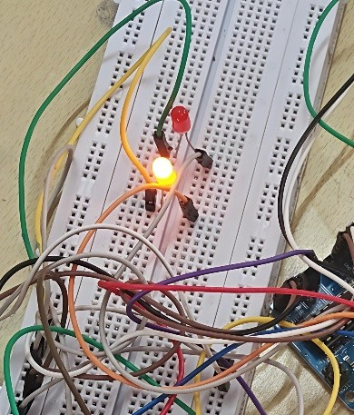
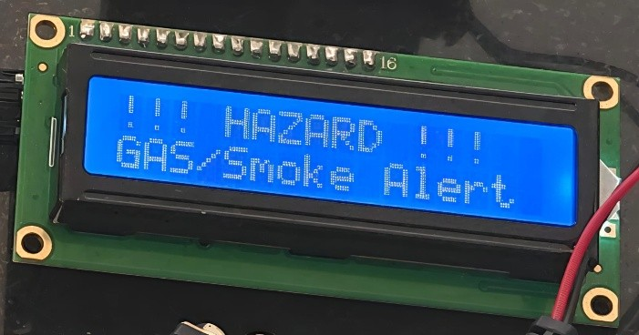
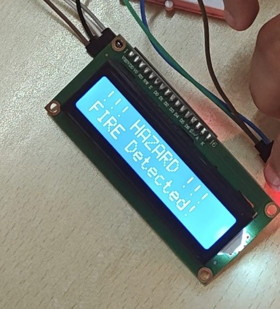
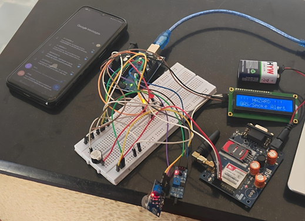
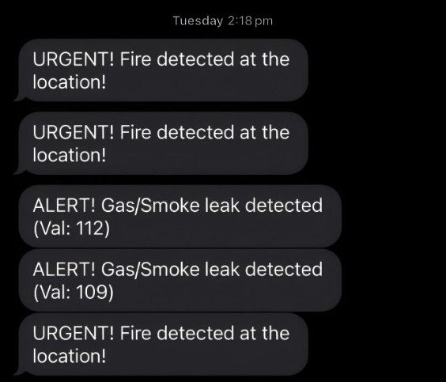
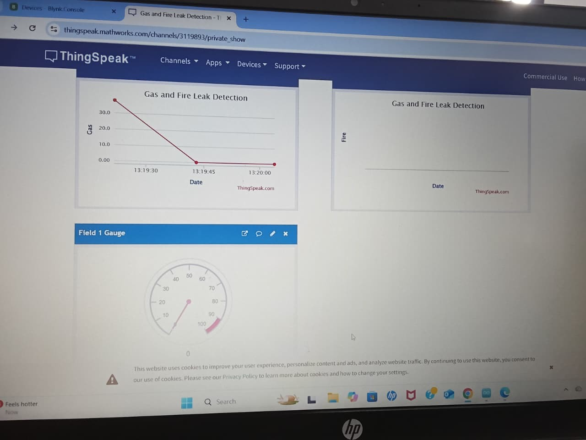

# 🔥 IoT-Based Fire and Gas Detector

**A hazard doesn't wait for someone to be in the room. Neither should your alarm system.**


An IoT-enabled safety system that senses gas leaks and fire in real time, sounds a local alarm, fires off an SMS the moment something's wrong, and streams live sensor data to a ThingSpeak cloud dashboard — so you know what's happening even when you're not home.

---

## 📑 Table of Contents

- [Why this project](#-why-this-project)
- [Problem statement](#-problem-statement)
- [How it works](#-how-it-works)
- [Hardware & Software](#-hardware--software)
- [Repository structure](#-repository-structure)
- [Setup](#-setup)
- [Results](#-results)
- [Gallery](#-gallery)
- [Future scope](#-future-scope)
- [Team](#-team)

---

## 🚨 Why this project

Traditional gas and fire detectors are stuck in one room, shouting into an empty house. They sound a buzzer — and that's it. No one gets notified remotely, nothing gets logged, and if you're not standing right there, the warning is wasted.

This system fixes that. It fuses local sensing with **GSM SMS alerts** and **ThingSpeak cloud logging**, so a gas leak or flame gets caught and reported — instantly — whether you're in the next room or on the other side of the city.

--

## 🎯 Problem Statement

Gas leaks and fire outbreaks remain among the most preventable causes of property damage and loss of life — yet the detection systems most homes and small businesses rely on haven't evolved much. Most existing setups fall into one of two categories:

- **Standalone smoke/gas detectors** that trigger a local buzzer and nothing else. If no one is within earshot, the alert is effectively useless.
- **Industrial-grade GSM/control-room systems** that do offer remote alerting, but are expensive, complex to install, and built for factories — not homes or small shops.

This creates a clear gap for affordable, connected safety hardware. Specifically:

- ❌ **No remote visibility** — you only find out about a hazard if you're physically present.
- ❌ **No historical data** — there's no log of gas levels over time, so trends (a slow leak, a recurring spike) go unnoticed.
- ❌ **High cost of entry** — cloud-connected industrial systems price out individual households and small businesses.
- ❌ **Delayed response** — without instant notification, response times increase, giving fires and leaks more time to escalate.

--

**Objectives of this project:**

1. Design and implement an IoT-based system capable of detecting hazardous gases (LPG, methane) and open flame.
2. Enable real-time data transmission and remote alerting using GSM.
3. Send immediate SMS notifications to users the moment a hazardous condition is detected.
4. Push live sensor data to ThingSpeak for remote visualization and historical tracking.
5. Keep the system reliable, low-power, and cheap enough to scale to real households — not just labs.

--
## Features
✅ Real-time Gas Detection
✅ Real-time Fire Detection
✅ LCD Alerts
✅ SMS Notification
✅ Cloud Dashboard
✅ Historical Data Logging
✅ Low Cost
✅ Easy Installation

--
**Tech Stack**
Microcontroller:
- Arduino UNO
- ESP32

Sensors:
- MQ5
- Flame Sensor

Communication:
- GSM
- UART
- WiFi

Cloud:
- ThingSpeak

Programming:
- Arduino C++

--

## ⚙️ How it works

1. An **Arduino** continuously reads the MQ-5 gas sensor and flame sensor.
2. The moment gas crosses a threshold or fire is detected:
   - 🔔 Buzzer and LEDs trigger instantly
   - 📟 LCD flashes a warning message
   - 📱 An SMS alert goes out via the GSM module
3. The Arduino streams live readings to an **ESP32** over serial.
4. The ESP32 hops on WiFi and pushes the data to **ThingSpeak**, powering a live remote dashboard.

```
MQ5        Flame Sensor
   \         /
    Arduino UNO
   / |   |   \
LCD GSM Buzzer LEDs
      |
   Serial UART
      |
    ESP32
      |
     WiFi
      |
 ThingSpeak Cloud
```
--

## 🧰 Hardware & Software

<table>
<tr>
<td valign="top" width="50%">

**Hardware**
- Arduino UNO
- ESP32
- MQ-5 Gas Sensor
- Flame Sensor
- Buzzer
- 2× LEDs (red, yellow)
- 16×2 LCD Display (I2C)
- GSM Module
- 5V Power Supply

</td>
<td valign="top" width="50%">

**Software**
- Arduino IDE
- ThingSpeak (cloud IoT platform)

</td>
</tr>
</table>

## 📂 Repository structure

```
images/
├── connections.png
├── fire-detection.jpg
├── gas-detection.jpg
├── gas-fire-detected.jpg
├── normal-state.jpg
├── sms-alert.jpg
├── ThingSpeak-abnormal-level.jpg
└── ThingSpeak-normal.jpg
src/
├── arduino_code.ino      # sensor reading, alarm logic, SMS alerts
├── esp32code.ino         # reads data from Arduino, uploads to ThingSpeak
└── secrets.h.example     # template — copy to secrets.h and fill in your own values
```
--

## 🛠️ Setup

1. **Wiring** — connect the MQ-5 gas sensor, flame sensor, buzzer, LEDs, LCD (I2C), and GSM module to the Arduino as shown in `images/connections.png`. Connect the Arduino's TX to the ESP32's RX2 (pin 16) for serial communication between the two boards.
2. **Secrets** — in `src/`, copy `secrets.h.example`, rename the copy to `secrets.h`, and fill in your phone number, WiFi credentials, ThingSpeak channel ID, and Write API Key. This file is gitignored, so your real credentials never get pushed.
3. **Arduino sketch** — open `src/arduino_code.ino` in the Arduino IDE, install the `LiquidCrystal_I2C` library, and upload to the Arduino.
4. **ESP32 sketch** — open `src/esp32code.ino` in the Arduino IDE, install the `ThingSpeak` library, and upload to the ESP32.
5. **Power on** both boards. Once the ESP32 connects to WiFi, live data appears on your ThingSpeak channel dashboard. ✅

> 💡 **Tip:** the Arduino IDE normally expects each `.ino` file to live in its own folder matching the sketch name. Since `arduino_code.ino` and `esp32code.ino` sit together in `src/`, open each file directly via **File → Open** (rather than double-clicking from a file browser) so it doesn't try to create a matching folder for you.

--

## 📊 Results

| Parameter | Traditional System | This System |
|---|:---:|:---:|
| Detection time | 10–15 sec | ⚡ 3–5 sec |
| Remote monitoring | ❌ No | ✅ Yes |
| Cost | 💰 High (industrial) | 💵 Low (consumer-level) |
| Maintenance | Manual | Automated |

- Gas leaks and flame were detected within seconds and correctly flagged on the LCD.
- SMS alerts landed in real time the moment a hazard was detected.
- Sensor data stayed visible remotely on ThingSpeak from any smartphone or PC.

--
## 🖼️ Gallery

| Normal State | Gas Detected | Fire Detected |
|:---:|:---:|:---:|
|  |  |  |

| Wiring | SMS Alert | ThingSpeak Dashboard |
|:---:|:---:|:---:|
|  |  |  |

--
## 🔮 Future scope

- 💨 Automatic ventilation / fire suppression — exhaust fans, gas valves, sprinklers
- 🎥 Raspberry Pi–based live video feed with automated fire-extinguishing control
- 🤖 AI-based predictive analytics to forecast hazards before they occur
- 🧪 Multi-sensor fusion (temperature, smoke, humidity, CO/CO₂) to cut false alarms
- 🏢 Centralized monitoring dashboard for multiple units across a building or facility
- ☁️ Long-term cloud data storage for trend analysis and reporting
--
## 👥 Team

- Akshata Chettiar
- Aarthi Chettiar
- Pavitra Boga
- Anoushka Rajesh

--

## 📜 License
Academic mini-project — feel free to reference for learning purposes.

<p align="center">Made with 🔧, ☁️, and a healthy fear of gas leaks.</p>
